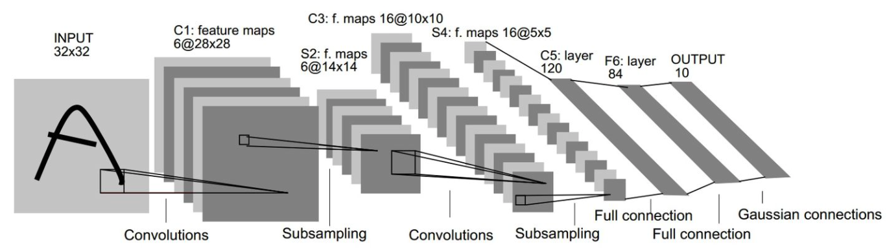
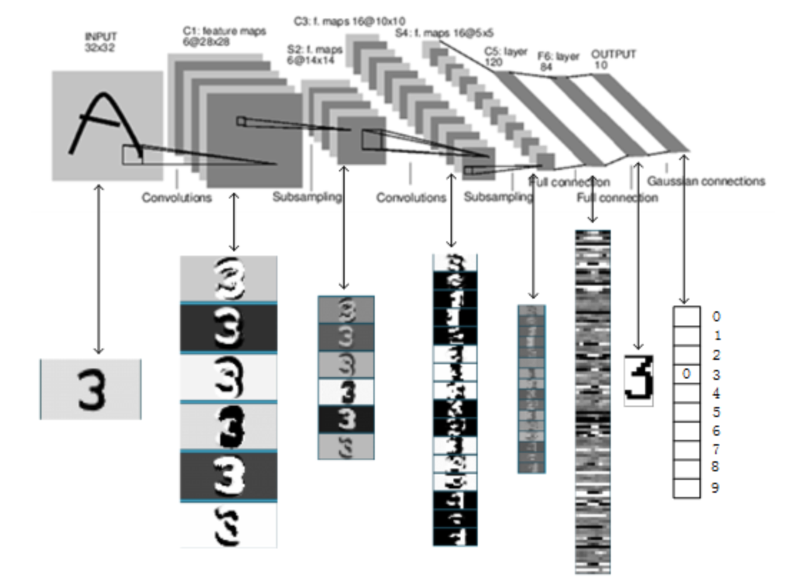
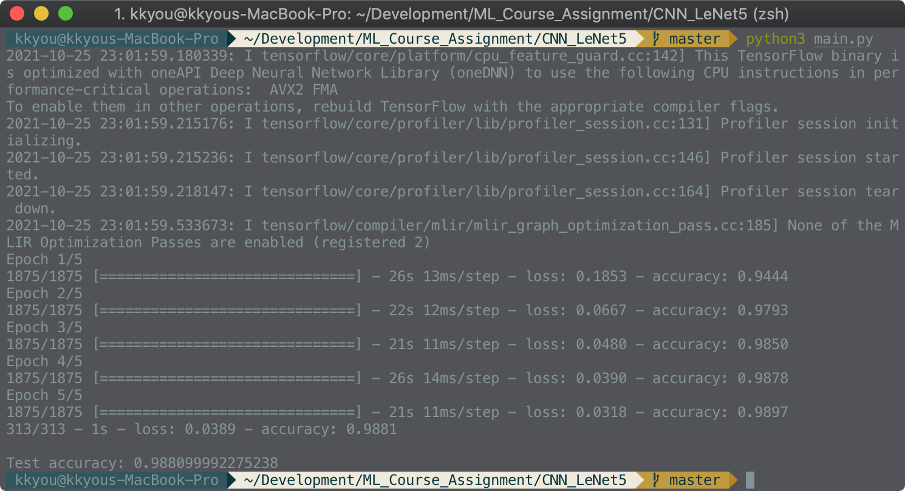
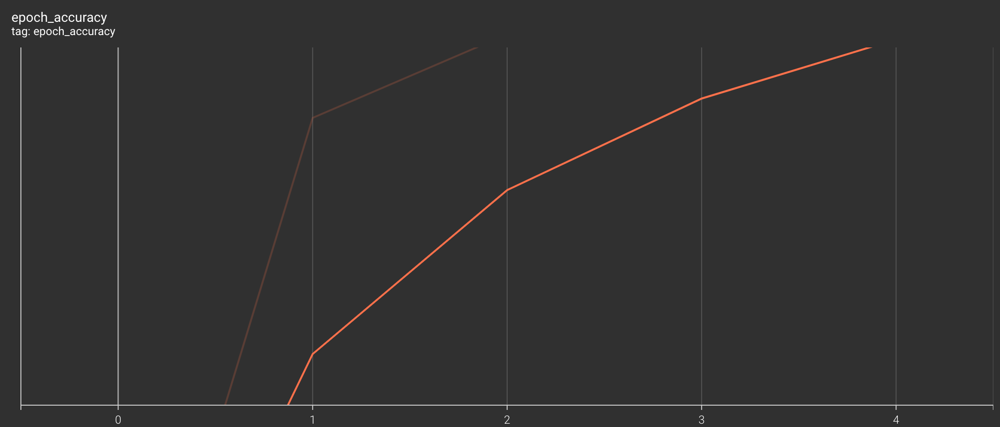
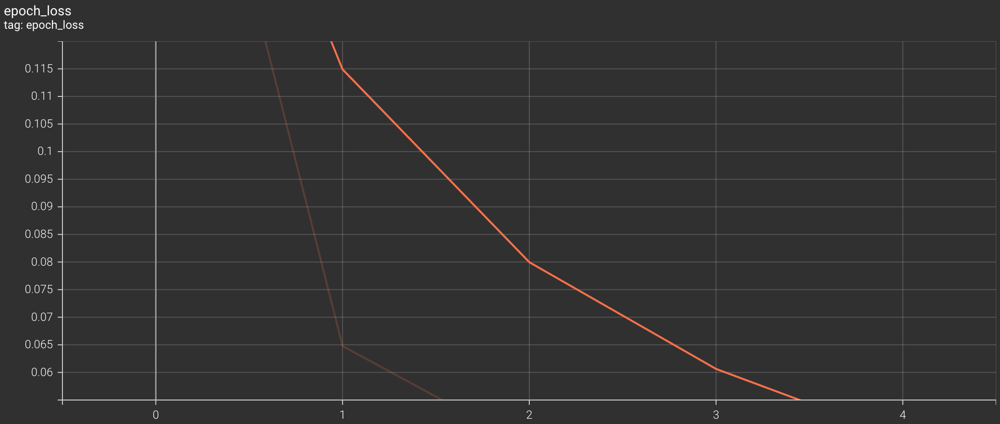
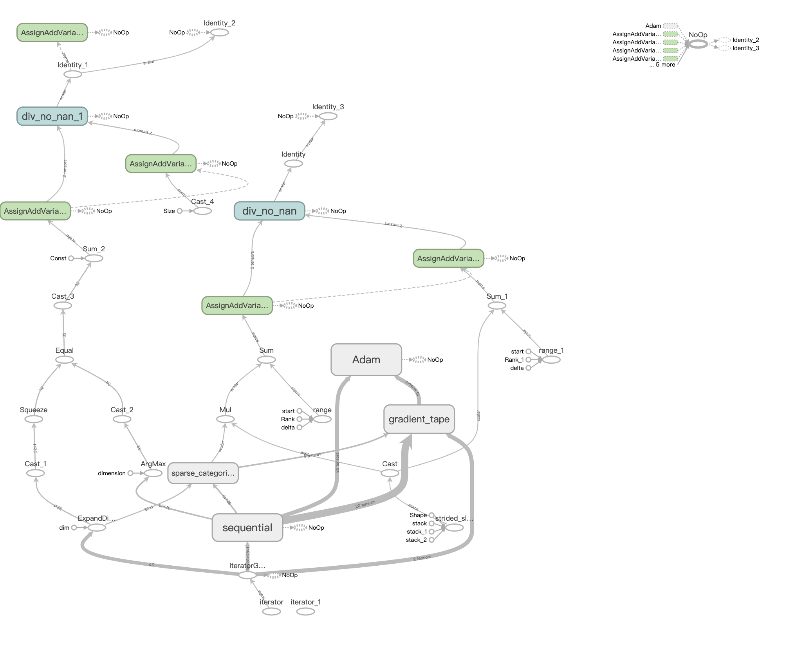

##  TensorFlow 实现 LeNet-5 识别 MINIST

#### 1.关键代码构建

##### 1.1 处理数据集

* 数据集导入后存储为0-255的RGB值，需要将其转换到0-1，所以先将数据除以255；
* 需要注意的是，TensorFlow中CNN中卷积操作需要第四维：图像的通道数，MNIST是灰度图像，所以扩展train_images和test_images的第四维为1。

```python
#导入mnist数据集
mnist = keras.datasets.mnist
(train_images, train_labels), (test_images, test_labels) = mnist.load_data()
#将数据转化为[0, 1]
train_images = train_images / 255.0
test_images = test_images / 255.0
#设置图像通道数量，mnist是灰度图像，故通道为1; 如果是RGB图形，通道为3
train_images = train_images.reshape((train_images.shape[0], train_images.shape[1], train_images.shape[2], 1))
test_images = test_images.reshape((test_images.shape[0], test_images.shape[1], test_images.shape[2], 1))
```

##### 1.2设置NeLet-5模型层次

LeLet-5层次模型如下图：



网络分为6层：

|        |      Layer      | Feature Map | Size  | Kernel Size | Stride |
| :----- | :-------------: | :---------: | :---: | :---------: | :----: |
| Input  |      Image      |      1      | 32x32 |      -      |   -    |
| 1      |   Convolution   |      6      | 28x28 |     5x5     |   1    |
| 2      | Average Pooling |      6      | 14x14 |     5x5     |   2    |
| 3      |   Convolution   |     16      | 10x10 |     5x5     |   1    |
| 4      | Average Pooling |     16      |  5x5  |     2x2     |   2    |
| 5      |   Convolution   |     120     |  1x1  |     5x5     |   1    |
| 6      |       FC        |      -      |  84   |      -      |   -    |
| Output |       FC        |      -      |  10   |      -      |   -    |

​	模型链接结构：

```
_________________________________________________________________
Layer (type)                 Output Shape              Param #   
=================================================================
conv2d (Conv2D)              (None, 24, 24, 6)         156       
_________________________________________________________________
max_pooling2d (MaxPooling2D) (None, 12, 12, 6)         0         
_________________________________________________________________
conv2d_1 (Conv2D)            (None, 8, 8, 16)          2416      
_________________________________________________________________
max_pooling2d_1 (MaxPooling2 (None, 4, 4, 16)          0         
_________________________________________________________________
flatten (Flatten)            (None, 256)               0         
_________________________________________________________________
dense (Dense)                (None, 120)               30840     
_________________________________________________________________
dense_1 (Dense)              (None, 84)                10164     
_________________________________________________________________
dense_2 (Dense)              (None, 10)                850       
=================================================================
Total params: 44,426
Trainable params: 44,426	
```

​	其中卷积层(Convolution)对图像做卷积操作，通过不同的卷积核可以提取不同的特征。时域的卷积等价于频域的乘积，通过卷积可以实现高通滤波，低通滤波等操作，进而提取图像的特征。采样层对卷积过后的图像进行亚采样，从而减少数据量，同时也保留有用信息。

​	LeNet-5识别数字3的过程图：



TensorFlow实现LeNet-5：

```python
model = keras.Sequential([
    keras.layers.Conv2D(6, kernel_size=5, strides=1, activation="relu"),
    keras.layers.MaxPool2D(pool_size = 2, strides = 2),
    keras.layers.Conv2D(16, kernel_size = 5, strides = 1, activation = "relu"),
    keras.layers.MaxPool2D(pool_size = 2, strides = 2),
    keras.layers.Flatten(input_shape = (28, 28)),
    keras.layers.Dense(120, activation="relu"),
    keras.layers.Dense(84, activation="relu"),
    keras.layers.Dense(10)
])
```

---


#### 2.结果分析

执行结果如下图，测试集准确率98.810%.



TensorBoard分析结果：

* Epoch Accuracy, 随着Epoch增加，准确率显著增加：



* Epoch Loss, 随着Epoch增加，Loss显著降低：



* Model Graph:



---


#### 3.总结

* 个人理解CNN利用了图像时域与频域之间的关系，对图像做预处理，节省了深度神经网络的参数，从而可以用简单的神经网络对处理后的图像特征做训练。
  * 图像高频信息：图像周围出现剧烈变化，通过高通滤波器(卷积)可以得到，得到图像的边缘。
  * 图像低频信息：图像周围信号变化不明显，通过低通滤波器(卷积)可以得到，得到模糊后的图像。
  * 可以通过其他卷积核得到图像不同信息。
* LeNet-5用很少层数就能达到很好的图像识别效果。