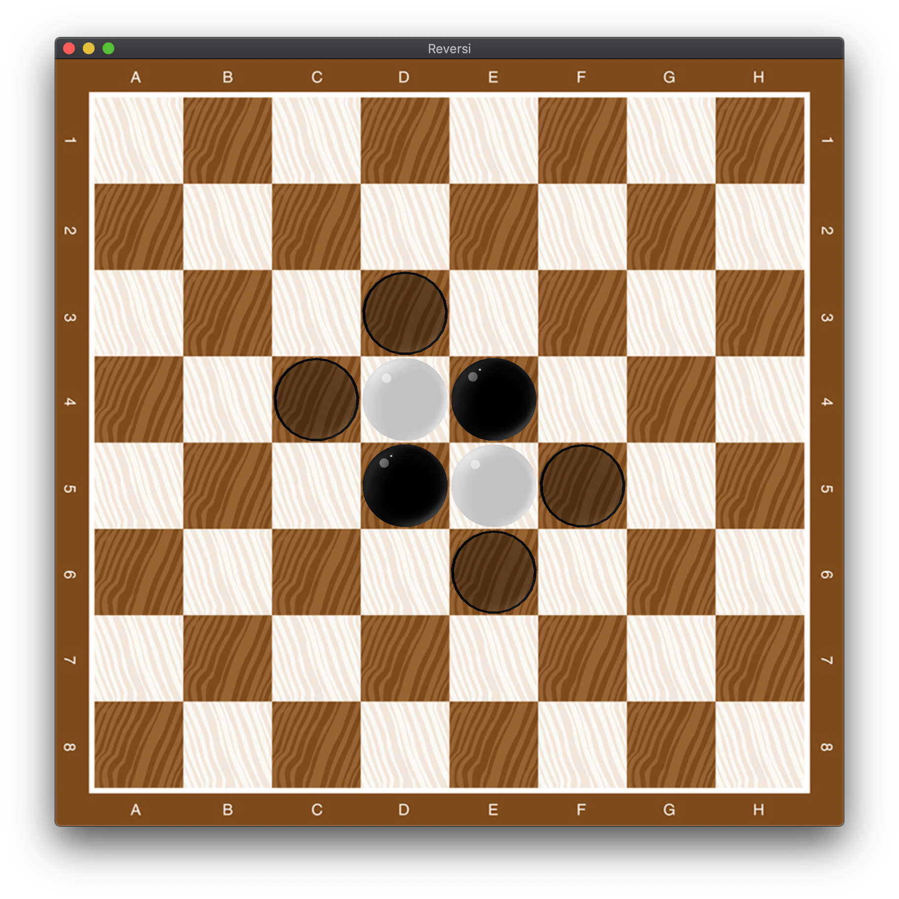

## MCTS Reversi

### Depends:

* [GLFW](https://www.glfw.org/)

### Structure:

* 后端：使用蒙特卡罗树搜索实现黑白棋对弈
* 前端：glfw实现前端渲染(实现简单的shader)

### Build&Run：

comple：

```shell
make
```

execute：

```shell
./reversi -model <pvp|pve|debug> -iterator <iterator times> [-round] [round times]
```

