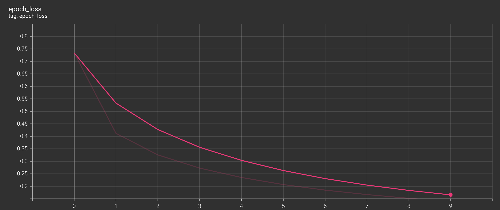

## 实践一.

#### 1.实验要求：

用TensorFlow程序完成从图像片段截取，到图像大小调整再到图像翻转及色彩调整的整个图像预处理过程。

#### 2.实验原理

用TensorFlow提供的接口函数对图像预处理。这些函数有：

```python
import tensorflow as tf

#将图片数据转化为实数类型，[0-255] -> [0.0-1.0]
tf.image.convert_image_dtype(image, dtype=tf.float32)
#图像片段截取
tf.image.resize_with_crop_or_pad(image, width, height)
#图像大小调整
tf.image.resize(image, width, height)
#图像翻转
tf.image.flip_left_right(image)
#色彩调整
tf.image.adjust_brightness(image, 0.5) # 调整明暗
saturation_img = tf.image.adjust_saturation(image, 5)   # 调整饱和度
```

#### 3.实验内容

1. 导入图片数据集；
2. 对图片进行从图像片段截取，到图像大小调整再到图像翻转及色彩调整的整个图像预处理过程；
3. 显示预处理效果。

#### 4.实验结果

显示对其中一张图片的处理效果：


可以看到，是我们想要的处理效果。


## 实践二.

#### 1.实验要求：

下载用ImageNet数据集训练好的经典卷积神经网络模型Inception-v3 ，并将该模型迁移至一个有5类花朵的新数据集上，训练得到在新数据集上有较高准确率的网络模型。

#### 2.实验原理

* 迁移学习：迁移学习获取已知问题学习到的特征，然后将这些特征运用到新的类似问题。
* 本次实验中，我们打算采用的迁移学习流程(未采用模型微调)：

​	


#### 3.实验内容

1. 导入依赖

```python
import numpy as np
import matplotlib.pylab as plt
import tensorflow as tf
import tensorflow_hub as hub
```

2. 处理数据

```python
train_ds = tf.keras.utils.image_dataset_from_directory(
  "flower_photos/",
  validation_split=0.2,
  subset="training",
  seed=123,
  image_size=(img_height, img_width),
  batch_size=batch_size
)
val_ds = tf.keras.preprocessing.image_dataset_from_directory(
  "flower_photos/",
  validation_split=0.2,
  subset="validation",
  seed=123,
  image_size=(img_height, img_width),
  batch_size=batch_size
)
normalization_layer = tf.keras.layers.Rescaling(1./255)
train_ds = train_ds.map(lambda x, y: (normalization_layer(x), y)) # Where x—images, y—labels.
val_ds = val_ds.map(lambda x, y: (normalization_layer(x), y)) # Where x—images, y—labels.
```

3. 通过使用带缓冲的预取来完成输入管道Dataset.prefetch，这样您就可以从磁盘生成数据而不会出现 I/O 阻塞问题

```python
AUTOTUNE = tf.data.AUTOTUNE
train_ds = train_ds.cache().prefetch(buffer_size=AUTOTUNE)
val_ds = val_ds.cache().prefetch(buffer_size=AUTOTUNE)
```

4. **导入去head的inception_v3**

```python
inception_v3 = "https://tfhub.dev/google/tf2-preview/inception_v3/feature_vector/4"
feature_extractor_model = inception_v3
```

5. **建立模型**

```python
model = tf.keras.Sequential([
  feature_extractor_layer,
  tf.keras.layers.Dense(num_classes) #classification head
])
```

模型结构：


6. TensorBoard回调：

```python
# 添加一个tf.keras.callbacks.TensorBoard回调来创建和存储日志：
log_dir = "logs/fit/" + datetime.datetime.now().strftime("%Y%m%d-%H%M%S")
tensorboard_callback = tf.keras.callbacks.TensorBoard(
    log_dir=log_dir,
    histogram_freq=1) # Enable histogram computation for every epoch.
```

7. 为了防止过拟合，设置early stopping

```python
early_stopping = callback = tf.keras.callbacks.EarlyStopping(monitor='loss', patience=3)
```

8. **训练模型**

```python
history = model.fit(train_ds,
                    validation_data=val_ds,
                    epochs=NUM_EPOCHS,
                    callbacks=[tensorboard_callback, 	early_stopping])
```

#### 4.实验结果

* 实验结果如下，测试集识别率88%左右：


* Epoch ACC:


* Epoch Loss:



* TensorBoard 模型图：


#### 5.反思与改进

* 最初我用inception-v3时未将其分类层去掉，直接在inception-v3后面又套了一个5个神经元的全连接输出层，最后识别率竟然能到85%左右，挺离谱的。
* 模型识别率只有88%左右，可以考虑解冻inception-v3，以极低的学习率对inception-v3微调。
* 尝试了Early Stopping，在epoch 8时就训练的差不多了，之后会更加过拟合。
* 尝试了在inception-v3和输出层之间加入rate=0.2的Dropout层，但结果改进不明显。

